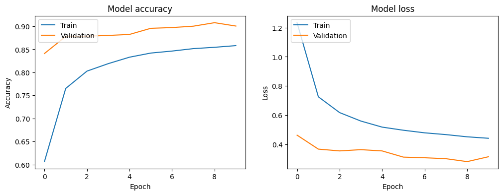
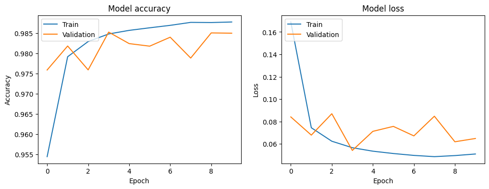

# LexiLearn-Machine-Learning
Machine Learning models and code for LexiLearn project

## Project Structure
The project is structured as follows:

```LexiLearn-Machine-Learning/
LexiLearn-Machine-Learning/
│
├── data/
│   ├── raw/
│   │   ├── emnist-letters-train-images-idx3-ubyte.gz
│   │   ├── emnist-letters-train-labels-idx1-ubyte.gz
│   │   ├── emnist-letters-test-images-idx3-ubyte.gz
│   │   ├── emnist-letters-test-labels-idx1-ubyte.gz
│   │   └── AZ_Handwritten_Data.csv     # AZ Handwritten dataset
│   ├── processed/
│   │   ├── emnist_preprocessed.npz       # Preprocessed EMNIST data
│   │   ├── emnist_letters_model.h5           # Trained EMNIST letters model in HDF5 format
│   │   ├── converted_model.tflite
│   │   ├── tfjs-models/
│   │   ├── az_preprocessed.npz           # Preprocessed AZ Handwritten data
│   │   ├── az-processed/                 # Processed AZ Handwritten data
│   │   └── extracted-mnist/              # Extracted MNIST data
│   ├── az-models/
│   │   ├── model.h5                      # Trained model in HDF5 format
│   │   ├── converted_model.tflite        # TensorFlow Lite model converted from the original model
│   │   └── tfjs_models/                  # TensorFlow.js models directory
│   │       ├── model.json                # TensorFlow.js model JSON file
│   │       └── group1-shard1of1.bin     # TensorFlow.js model binary weights file
│
├── colab-notebooks/            # Notebooks for data preprocessing and model training
│   ├── EMNIST_Preparation_and_Preprocessing.ipynb
│   └── AZ_Preparation_and_Preprocessing.ipynb
│
├── scripts/              # Python scripts for data preprocessing, model training, and model conversion
│   ├── preprocess_data.py
│   ├── train_model.py
│   └── convert_model.py
│
├── app.py                 # Main application script using Flask
│
└── README.md              # Project overview and setup instructions
```

## Environment
This project utilizes the following Python libraries and dependencies:

```
numpy==1.24.3
pandas==2.0.3
Pillow==10.0.0
scipy==1.10.1
tensorflow==2.13.0
tensorflow-datasets==4.9.2
```

To set up the environment, install these dependencies using pip:

```
pip install -r requirements.txt
```

Ensure you are using Python 3.9 or later.

## Scripts
This section contains Python scripts for different tasks in the machine learning pipeline.

- `preprocess_data.py`: Script for preprocessing raw data, including extracting, loading, and preprocessing images and labels.
- `train_model.py`: Script for training machine learning models using preprocessed data.
- `convert_model.py`: Script for converting trained models to the TensorFlow Lite format for deployment on mobile devices

## Models
This folder contains trained machine learning models.
### EMNIST Letters
- `emnist_letters_model.h5`: Trained TensorFlow/Keras model for handwritten text recognition using the EMNIST letters dataset.
- 

### AZ Handwritten
- `az_handwritten_model.h5`: Trained TensorFlow/Keras model for AZ Handwritten dataset.
- `tfjs_models/`: Folder containing TensorFlow.js models for AZ Handwritten dataset.
- `model.json`: TensorFlow.js model JSON file.
- `group1-shard1of1.bin`: TensorFlow.js model binary weights file.
- `az_handwritten_model.tflite`: TensorFlow Lite model converted from the original TensorFlow/Keras model.

## Processed Data
This directory contains preprocessed data used for training and evaluation.
- `emnist_preprocessed.npz`: Preprocessed data for training and testing machine learning models, including images and labels.

## Converted Models
This directory stores models converted to TensorFlow Lite format for deployment on mobile devices.
- `converted_model.tflite`: TensorFlow Lite model converted from the original TensorFlow/Keras model.

## Model Evaluation
### EMNIST Letters
- Test Accuracy: 0.9006
- Precision: 0.9036
- Recall: 0.9006
- F1 Score: 0.9008

### AZ Handwritten
- Validation Accuracy: 0.9850
- Training Accuracy: 0.9895
- Weighted F1 Score: 0.9876
- F1 Score per Class:
    - Class A: 0.9883
    - Class B: 0.9838
    - Class C: 0.9893
    - Class D: 0.9644
    - Class E: 0.9866
    - Class F: 0.9764
    - Class G: 0.9698
    - Class H: 0.9729
    - Class I: 0.9760
    - Class J: 0.9785
    - Class K: 0.9828
    - Class L: 0.9849
    - Class M: 0.9897
    - Class N: 0.9854
    - Class O: 0.9919
    - Class P: 0.9926
    - Class Q: 0.9712
    - Class R: 0.9843
    - Class S: 0.9958
    - Class T: 0.9915
    - Class U: 0.9902
    - Class V: 0.9938
    - Class W: 0.9833
    - Class X: 0.9860
    - Class Y: 0.9801
    - Class Z: 0.9803
 
## Model Training and Evaluation

### EMNIST Letters Dataset



The graph above shows the changes in accuracy and loss during the training process using the EMNIST Letters dataset. The training achieved approximately 90.06% accuracy on the test set.

### AZ Handwritten Dataset



The graph above shows the changes in accuracy and loss during the training process using the AZ Handwritten dataset. The training achieved approximately 98.50% accuracy on the validation set.


## Flask Application
The app.py script serves as the main application script using Flask. It can be used to deploy machine learning models as web services, allowing for predictions based on the trained models.

## Google Colab Integration
Notebooks in the colab-notebooks/ directory are optimized for use with Google Colab. Ensure that you have the necessary permissions and access to Google Drive for loading and saving files within the Colab environment. Use the following Google Colab Drive link for seamless integration with the notebooks: [Google Colab Drive](https://drive.google.com/drive/folders/1rv7tuaZkkru9I2DZzn_KFtbypAAsZFmB?usp=drive_link)
